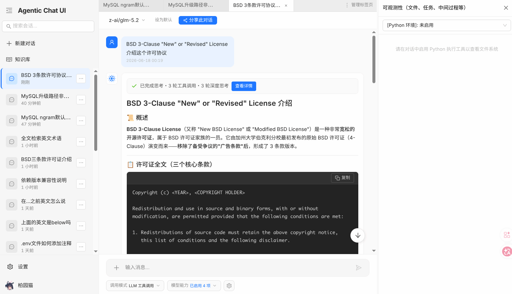

# jiallo-platform

A unified AI platform based on Spring AI Alibaba, Antd Design and other popular technologies. Currently provided Agentic Chat UI experience and RAG functionality. Suitable for both personal deployment and deploy as SaaS.

基于 Spring AI Alibaba、Antd Design 等流行技术开发的统一 AI 平台。目前提供了 Agentic Chat UI 和 RAG 功能。同时适合个人部署和作为 SaaS 部署。



> Additional Notice: Currently the interface only supports Chinese (Simplified) as interface language.
> 
> 提醒：目前界面仅支持中文（简体）作为界面语言。

## Features / 功能

* Full-text search based RAG 基于全文检索的 RAG
* High performance and easy to scale-out 高性能且易于横向扩展
* Multi-User design 多用户设计
* User group 支持用户组的权限设计
* Share conversations 分享会话
* Agentic Chat UI 为 Agentic 设计的聊天界面
* Secure by-default 默认的安全设置
* Java-based 基于 Java 开发

## Quick Deploy / 快速部署

### Docker Compose (Build yourself), Recommended

> Notice: This method doesn't need you to install MySQL, RustFS and Redis manually. However, this may cause resource waste if you already have a MySQL, RustFS or Redis instance. To be precise, we recommend you have at least 1.5GB of free memory to run the whole project and its dependencies.
> 
> 注意：此方法不需要您手动安装 MySQL、RustFS 和 Redis。但是，如果您已经拥有 MySQL、RustFS 或 Redis 实例，则此方法可能会导致资源浪费。具体来说，若使用此方法，我们建议您至少有 1.5GB 的空闲内存来运行整个项目及其依赖项。

Requirements:
* Docker
* Docker Compose
* Git

1. Clone the repository 克隆本仓库

```bash
git clone https://github.com/baiyuanneko/jiallo-platform.git
```

2. Set up environment variables 设置环境变量

Copy the `.env.example` file to `.env` and modify the variables as needed.

Please carefully read the instructions in the `.env.example` file before start! Especially the part about how to generate and set the necessary keys.

将`.env.example`文件复制为`.env`，并修改变量。

请在开始之前务必仔细阅读 `.env.example` 文件中的说明！尤其是关于如何生成和设置所需密钥的部分。

3. Build the images 构建镜像

```bash
docker compose build
```

4. Run 运行

```bash
docker compose up -d
```

If you want to upgrade later when you pull the repository again, you can use the following command:

（如果你稍后想要更新，你需要先重新拉取仓库，然后允许以下命令来重新构建）

```bash
docker compose build
```

Then run again:

（然后重新运行：）

```bash
docker compose down && docker compose up -d
```

## How to use / 使用方法

### First setup / 初始设置

Every user, even the administrator will **NOT** automatically get access to any LLM Model, Agent and Features.

You must assign the permission to access the resources as the following steps:

1. Goto the admin panel
2. After you added a LLM model config at "System LLM Provider Management", you can whether choose to do "User Group based authorization" or "Role based authorization", or you can use both. Detailed steps are as follows:

所有用户（即使是管理员）都不会自动获得访问任何 LLM 模型、智能体和功能的权限。

你必须按照以下步骤为这些资源分配访问权限：

进入管理面板在系统模型提供商管理中添加了 LLM 模型配置后，你可以选择进行“基于用户组的授权”或“基于角色的授权”，也可以两者兼用。详细步骤如下：

#### User Group based authorization / 基于用户组的授权

1. Goto "User Group Management" in admin panel
2. Add a user group, such as "certificated_users" or any other name you like, and then add users (such as the administrator, yourself) to it.
3. Go to "Model and authorizations" and do authorization to the user group you've created one model by one model when you want the user group to access it.
4. Go to "Agent authorizations" and do the same. Notice that the "LLM Tool Call" refers to the basic conversation and task agent and usually you need to assign it if you want to use Agentic Chat UI.
5. Go to "Function and module authorizations" and do the same.

---

1. 进入管理面板的用户组管理。
2. 添加一个用户组，例如“certificated_users”或任何你喜欢的名称，然后将用户（例如管理员或你自己）添加到该组中。
3. 进入"模型与授权"，当你希望该用户组访问某个模型时，请逐一将模型授权给对应用户组。
4. 进入“智能体授权”并进行同样的操作。请注意，LLM 工具调用指的是基础对话和任务智能体，如果你想使用 Agentic Chat UI（智能体聊天界面），通常需要为其分配权限。
5. 进入“功能与模块授权”并进行同样的操作。

#### Role based authorization / 基于角色的授权

Notice that role cannot be created or edited, while user groups can. 注意：不能创建或编辑角色定义，但是可以自由创建和编辑用户组。

1. Go to "Model and authorizations" and do authorization to the role one model by one model when you want the role to access it.
2. Go to "Agent authorizations" and do the same. Notice that the "LLM Tool Call" refers to the basic conversation and task agent and usually you need to assign it if you want to use Agentic Chat UI.
3. Go to "Function and module authorizations" and do the same.

---

1. 进入"模型与授权"，当你希望某角色访问某个模型时，请逐一将模型授权给对应角色。
2. 进入“智能体授权”并进行同样的操作。请注意，LLM 工具调用指的是基础对话和任务智能体，如果你想使用 Agentic Chat UI（智能体聊天界面），通常需要为其分配权限。
3. 进入“功能与模块授权”并进行同样的操作。

### Essential setup / 基本设置

1. Goto "System settings" in admin panel
2. Set a "simple task model"

---

1. 在管理面板中进入系统设置。
2. 设置一个“简单任务模型”，这会成为生成标题等任务的默认模型。

## Local Development / 本地开发

Dependencies:

* JDK 21
* Node.js v26 + NPM v11.14.1
* MySQL 9.6
* Redis 8.8.0
* RustFS v1.0.0-alpha.93

The program is developed and tested on the dependencies above. You may try to use different versions or compatible implementations of the dependencies, however idk whether it will work.

本程序是在上述依赖环境下开发与测试的。你可以试试用其他版本或兼容的依赖，但行不行得通我就不知道了。

The program contains two parts: the java backend and the vue frontend.

本程序由两部分组成：Java 后端和 Vue 前端。

### Java Backend

The Java backend is a standard Spring Boot application. The ORM is MyBatis Plus. Spring Security is used for authentication and authorization.

If you are not familiar to Java developement and wants to develop the backend, we recommend you use IntelliJ IDEA (Community or Ultimate) to open the project as Maven project. Then you can modify the application.yml to connect to your local MySQL, Redis or RustFS instance. You can go to 'Maven' panel and click the 'sync maven project' button to install the dependencies. Then you can navigate to src/main/java/moe/byn/Bynspring21Application and click the green Run button to start the application.

Java 后端是一个标准的 Spring Boot 应用程序。ORM 使用的是 MyBatis Plus，并使用 Spring Security 进行身份认证和授权。

如果你不熟悉 Java 开发，但想参与后端开发，我们建议你使用 IntelliJ IDEA（社区版或旗舰版）以 Maven 项目的形式打开本项目。然后，你可以修改 application.yml 文件来连接你本地的 MySQL、Redis 或 RustFS 实例。你可以进入 Maven 面板并点击“sync maven project”（同步 Maven 项目）按钮来安装依赖项。最后，定位到 src/main/java/moe/byn/Bynspring21Application，点击绿色的运行按钮即可启动应用程序。

### Vue Frontend

Use `npm install` to install the dependencies and `npm run dev` to start the development server.

使用 npm install 安装依赖，使用 npm run dev 启动开发服务器。

## License / 许可证

BSD 3-Clause "New" or "Revised" License

## Contributions

PR/Issues welcome! 欢迎 PR 和 Issues!

If you find security issues, we recommend you to contact me privately at baiyang-lzy@outlook.com instead of publishing on the issue section. Thanks!

如果你发现本项目存在安全漏洞，建议是发往我的邮箱 baiyang-lzy@outlook.com 而不是直接发布在 Issues 区。感谢！

## Special Thanks

See [THANKING.md](./THANKING.md).